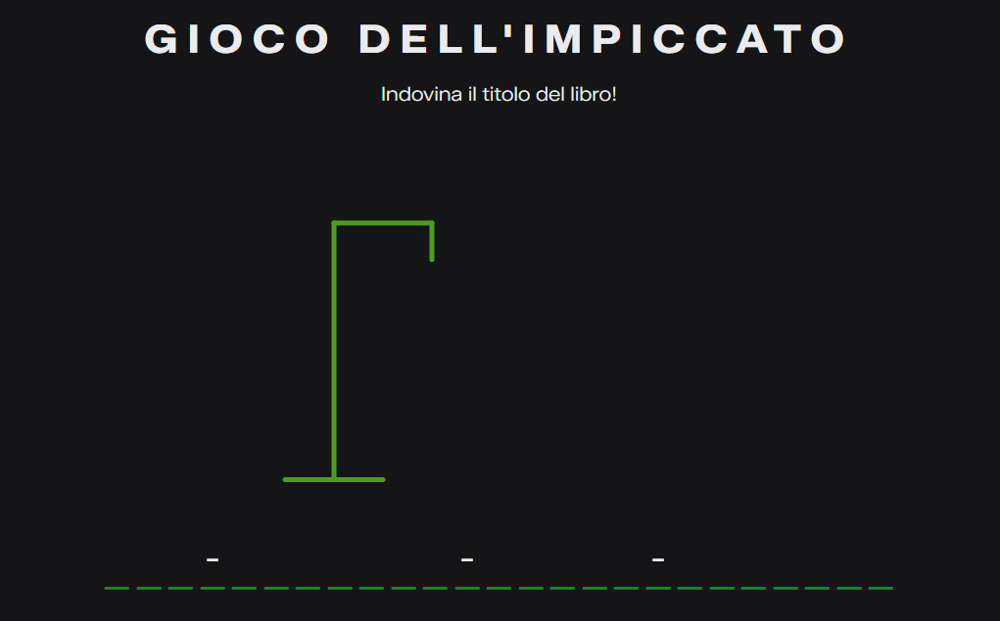
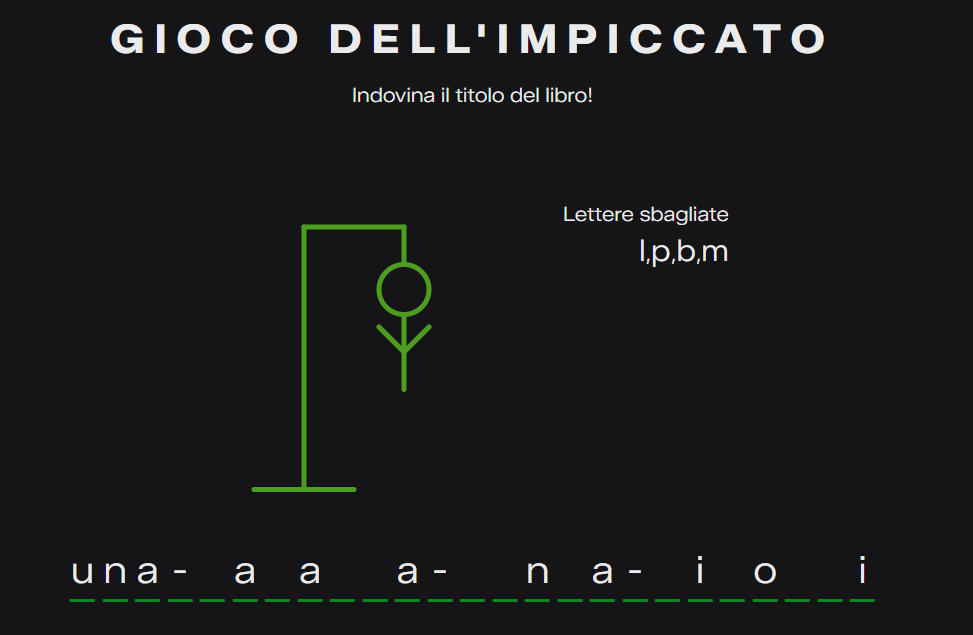
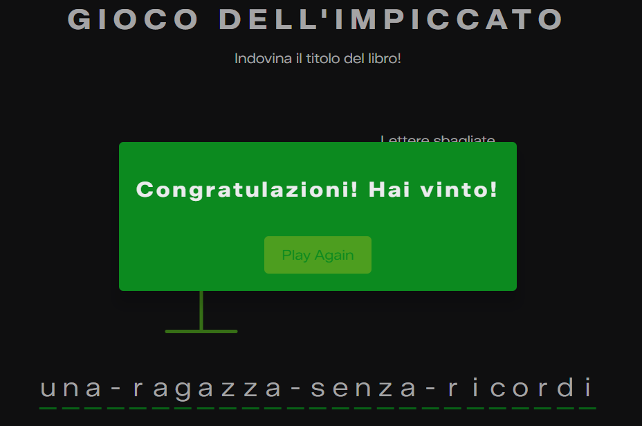
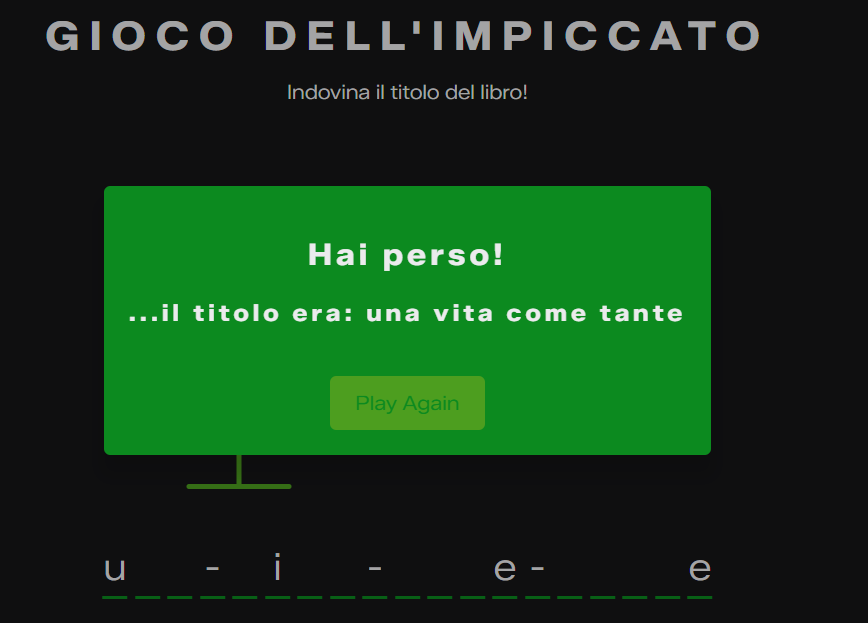

# Descrizione del gioco dell’Impiccato
### Il gioco consiste nell’indovinare il titolo di un libro presente nel catalogo della biblioteca prima che il corpo venga impiccato.

**Regole:**
- Il titolo del libro da indovinare è nascosto e rappresentato da trattini al posto delle lettere.
- Gli spazi tra le parole sono indicati con un trattino (“-”) e non devono essere indovinati.
- Il giocatore propone una lettera alla volta.
- Se la lettera è presente nel titolo, tutte le occorrenze di quella lettera vengono rivelate.
- Se la lettera non è presente, viene disegnata una parte del corpo sull’impiccato.
- Il gioco termina quando:

   - Il giocatore indovina tutte le lettere del titolo (vittoria), oppure
   - Il disegno dell’impiccato è completato (sconfitta).
- Le vittorie vengono registrate e salvate nella tabella utenti del database.

